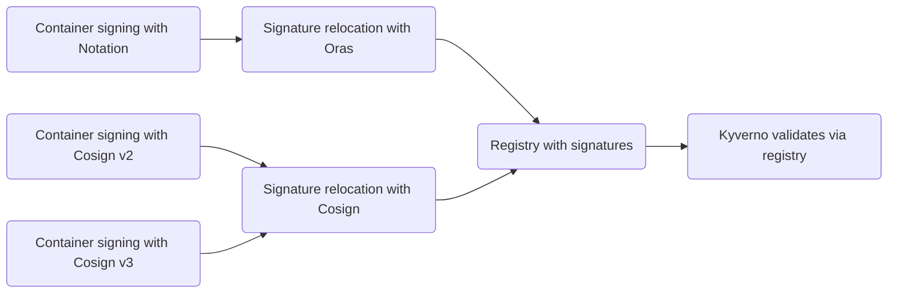
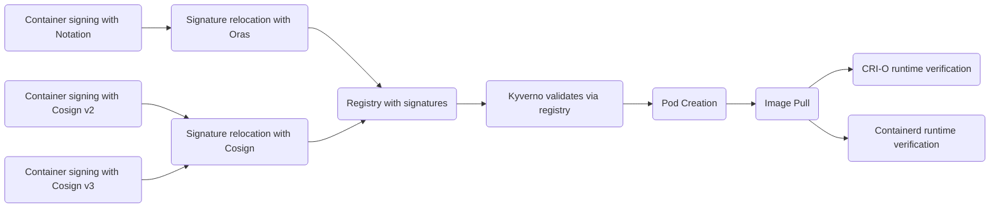
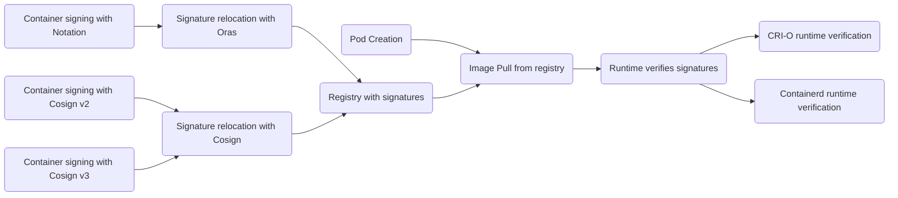

# Container Signing POC
<!-- cSpell:ignore kyverno,oras,sigstore,rebranded,pkcs,fulcio,rekor,containerd -->

This experiment has multiple parts and options:

1. Image signing:

   - [Signing images with Notation, especially with custom signers](notation/README.md)
   or
   - [Signing with Cosign v2 (external signer)](cosign-v2/README.md)
   or
   - [Signing with Cosign v3 (native signing)](cosign-v3/README.md)

1. Signature relocation:

   - [Moving signatures from one registry to another with Oras](oras/README.md)
   or
   - Moving Cosign signatures from one registry to another with Cosign

1. Admission controller verification:

   - [Validating the signing with Kyverno admission controller](kyverno/README.md)

1. Container runtime verification:

   - [CRI-O](crio/README.md)
   or
   - [Containerd](containerd/README.md)

## Flow with Kyverno admission controller

## Flow with Kyverno and container runtime verification both

## Flow with container runtime verification

## TL;DR of the POC

Basically, the POC is finding the following:

### Notation

1. Notation is extendable with their plugin system
1. Plugin that can call any external script or binary to produce a signature has
   been implemented.
1. This allows any in-house, custom integration to private signer, regardless
   of the interface, even manual/email works (despite being brittle), without
   writing a full-fledged plugin with Go.
1. Notation can handle SHA512 with PSS, no problem
1. Kyverno can easily be configured to verify Notation signatures runtime, via
   their admission controller and pluggable policies.
1. Oras can be used to move containers and signatures from CI to production

### Cosign

1. Cosign does not need plugins as it can be operated via command line to
   achieve external signing (v2) or use native signing (v3).
1. Cosign v2 uses external signer + `cosign attach signature` for legacy format
1. Cosign v3 uses native `cosign sign --key` for new bundle format
1. Both v2 and v3 use same CA-based certificate verification
1. Cosign can also save and load images with signatures by itself, Oras is not
   needed
1. Cosign ecosystem can only handle SHA-256 hashing with RSA PKCS#1 v1.5.
   Anything other than those (e.g., SHA-512, PSS padding) lack support as
   Sigstore wants support to be homogenous across all of its services, so
   implementing it is not trivial.
1. Kyverno can be used with Cosign the same as Notation, just a little bit more
   configuration needed in the manifest to disable transparency logs and SCTs.

## Runtime-Level Verification

1. CRI-O 1.34+ has built-in signature verification support via policy.json
1. Containerd 2.1+ can verify signatures at runtime via Transfer Service API

Both could also verify signatures using OCI hooks, with cost of performance hit
on each container creation. This would allow malicious, unsigned images hit the
local disk, which is not ideal either.

## e2e test

End-to-end test for this POC can be run with `make notation`, `make cosign-v2`,
or `make cosign-v3` from this directory.

This will setup Kyverno in Kind cluster, install required Kyverno ClusterPolicies
and sign images, then try run them. Only pods with proper signatures will run
and the ones without signature will fail. Same is done for deployments, to
verify that as well.

Note: Due to issues with Kind cluster setup, pods do not end up running, but
will show `ImagePullErr`. This is OK. As long as only pods with `success` in
their name are created, POC is success. If no pods are created, or pods with
`fail` in their name are created, then it is a failure.

### CRI-O and containerd e2e tests

These scenarios should be run in standalone test VMs as they will install
and configure container runtimes and not care if there is existing configurations.
For these, in respective directories, run `make setup` to install and configure
the runtime, then `make run` to run the e2e tests.

## Notes

### Notes on Notation

Notary V1 was part of TUF (The Update Framework) organization, yet separate
project in CNCF. Notary V2 has been rebranded as Notation to make the branding
clearer that it is based on different principles than Notary V1. Notary V1/TUF
has more strict "security principles", which also made it hard to use, and it
did not gain traction.

It should be noted that Notary V1 and Notary V2/Notation are completely different
projects, with claims of [hostile takeover](https://github.com/cncf/toc/issues/981)
by the new maintainers (Microsoft/Docker). CNCF TOC did not see it that way,
but funded a
[security audit](https://www.cncf.io/blog/2023/07/11/announcing-results-of-notation-security-audit-2023/)
for Notation, with no critical findings, but the argument from the Notary V1
folks is that the foundation of Notation security model is not good enough. This
design aspect was not part of the audit based on the findings.

### Notes on Kyverno

[Kyverno Image Signature verification](https://kyverno.io/docs/writing-policies/verify-images/)
is no longer in beta in v1.13.0 onwards.

Kyverno can also verify Sigstore Cosign signatures.

Kyverno is generic policy engine, capable of replacing OPA Gatekeeper etc.

### Notes on Oras

Oras can handle any OCI binary or blob perfectly fine. With Cosign, using Oras
is not necessary as cosign CLI can load/save OCI containers identically to
Oras, which includes handling Cosign signatures attached to images.

### Notes on Cosign

While other components here are CNCF projects, Cosign is OpenSSF project. It is
developed on top of TUF framework, and is more of a continuation to Notary v1
than Notary v2/Notation ever was. Sigstore ecosystem contains not only Cosign,
but also Rekor and Fulcio for certificate management and transparency log servers,
as well as support for many languages, like Go, Python, Ruby, Java etc. This is
a strength and a weakness the same time, as mentioned before related to SHA256
hardcoding problem.

### Notes on CRI-O

CRI-O requires version 1.34+ for built-in signature verification support via
policy.json. The support comes from the underlying containers/image library, which
has had signature verification support since February 2025.

### Notes on Containerd

Containerd's Transfer Service API based image verification is a new feature
added in version 2.1+. It allows pluggable verifiers to be used during
image pulls, to verify signatures or do other checks before allowing the image
to be used.
