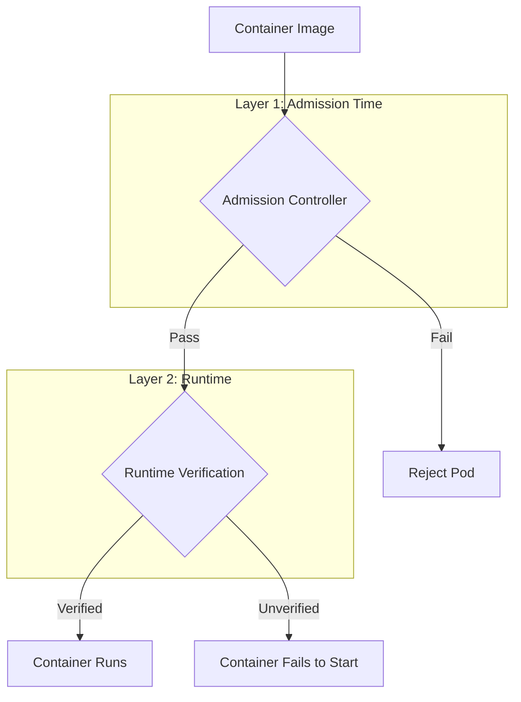

# Container Runtime Signature Verification POC Plan

## Overview

This document outlines the plan for implementing minimal POCs for container signature verification at the runtime level for both CRI-O and containerd. The goal is to demonstrate runtime-level signature verification that complements the existing admission controller (Kyverno) approach.

## Background

The repository already contains:
- Signing infrastructure (Cosign and Notation)
- Kyverno admission controller policies for signature verification
- E2E tests for admission-time verification

This POC extends the verification to the **container runtime level**, providing defense-in-depth.

## Architecture Overview



---

## CRI-O POC

### Background
CRI-O has **built-in support** for signature verification using the `containers/image` library and policy files. It supports:
- Cosign signatures
- Simple signing (GPG-based)
- Policy-based verification with `/etc/containers/policy.json`

### Implementation Strategy

Since CRI-O requires configuration changes at the runtime level and cannot be modified on the local machine, we have two approaches:

#### **Option A: VM-based approach (Recommended)**
- Deploy CRI-O in a dedicated VM
- Full control over runtime configuration
- Most realistic production scenario

#### **Option B: Kind-based approach with CRI-O**
- Create a custom Kind node image with CRI-O instead of containerd
- More complex but keeps everything local
- Requires building custom node image

**Recommendation:** Start with **Option A (VM-based)** for simplicity and clarity. Kind + CRI-O integration is complex and non-standard.

### Components

```
crio/
├── README.md                          # Complete documentation
├── Makefile                           # Automation scripts
├── config/
│   ├── policy.json                    # CRI-O signature verification policy
│   ├── registries.d/
│   │   └── default.yaml              # Registry configuration for sigstore
│   └── crio.conf.d/
│       └── 01-signature-verification.conf  # CRI-O runtime config
├── scripts/
│   ├── setup-vm.sh                    # VM setup automation
│   ├── configure-crio.sh              # Configure CRI-O for signature verification
│   ├── sign-images.sh                 # Sign test images with cosign
│   └── test-verification.sh           # Test signature verification
├── manifests/
│   ├── signed-pod.yaml                # Pod using signed image
│   └── unsigned-pod.yaml              # Pod using unsigned image (should fail)
└── vm/
    ├── Vagrantfile                    # Vagrant VM definition (optional)
    └── cloud-init.yaml                # Cloud-init for cloud VMs

```

### Policy Configuration

CRI-O uses `/etc/containers/policy.json` for signature verification. Example policy:

```json
{
  "default": [{"type": "reject"}],
  "transports": {
    "docker": {
      "localhost:5003": [{"type": "insecureAcceptAnything"}],
      "127.0.0.1:5003": [
        {
          "type": "sigstoreSigned",
          "keyPath": "/etc/containers/keys/cosign.pub",
          "signedIdentity": {"type": "matchRepository"}
        }
      ]
    }
  }
}
```

### Testing Workflow

1. **Setup**: Configure VM with CRI-O and signature verification policy
2. **Sign**: Sign container images with cosign (reuse existing signing infrastructure)
3. **Deploy**: Deploy pods with signed and unsigned images
4. **Verify**: 
   - Signed images should run successfully
   - Unsigned images should be rejected by CRI-O runtime
5. **Observe**: Check CRI-O logs for verification messages

### Expected Outcomes

- CRI-O rejects unsigned containers at runtime
- Proper error messages in CRI-O logs
- Pods with signed images start successfully
- Defense-in-depth: Even if admission controller is bypassed, runtime blocks unsigned images

---

## Containerd POC

### Background
Containerd **does not have built-in signature verification** support yet. The recommended approach is to use:
- **OCI Hooks** - PreCreate hooks that run before container creation
- External verification tool (cosign or custom verifier)

### Implementation Strategy

Use OCI Runtime Hooks to intercept container creation and verify signatures:

1. Configure containerd to use OCI hooks
2. Create a prestart/precreate hook that verifies image signatures
3. Hook script uses cosign or custom verification logic
4. If verification fails, hook exits with non-zero, preventing container start

### Components

```
containerd/
├── README.md                          # Complete documentation
├── Makefile                           # Automation scripts
├── hooks/
│   ├── verify-signature.sh            # OCI hook script for signature verification
│   └── config.json                    # OCI hooks configuration
├── config/
│   └── containerd-config.toml         # Containerd configuration with hooks
├── scripts/
│   ├── setup-vm.sh                    # VM setup (or Kind setup)
│   ├── configure-containerd.sh        # Configure containerd with hooks
│   ├── install-hooks.sh               # Install OCI hook binaries
│   ├── sign-images.sh                 # Sign test images with cosign
│   └── test-verification.sh           # Test signature verification
├── manifests/
│   ├── signed-pod.yaml                # Pod using signed image
│   └── unsigned-pod.yaml              # Pod using unsigned image (should fail)
└── kind/
    ├── kind-config.yaml               # Kind cluster config with containerd hooks
    └── setup-kind.sh                  # Setup script for Kind-based testing

```

### OCI Hook Implementation

OCI hooks are configured in `/etc/containerd/config.toml`:

```toml
[plugins."io.containerd.grpc.v1.cri".containerd]
  snapshotter = "overlayfs"
  
[plugins."io.containerd.grpc.v1.cri".containerd.runtimes.runc]
  runtime_type = "io.containerd.runc.v2"
  
[plugins."io.containerd.grpc.v1.cri".containerd.runtimes.runc.options]
  SystemdCgroup = true
  
# Configure OCI hooks
[plugins."io.containerd.grpc.v1.cri".containerd.runtimes.runc]
  base_runtime_spec = "/etc/containerd/cri-base.json"
```

The hook configuration (`/etc/containerd/cri-base.json`):

```json
{
  "hooks": {
    "prestart": [
      {
        "path": "/usr/local/bin/verify-signature-hook",
        "args": ["verify-signature-hook", "prestart"],
        "env": ["COSIGN_PUBKEY=/etc/containerd/keys/cosign.pub"]
      }
    ]
  }
}
```

### Hook Script Logic

The verification hook script (`verify-signature.sh`):

```bash
#!/bin/bash
# OCI Hook for container signature verification
# Receives container state via stdin

set -e

# Read container state from stdin
STATE=$(cat)
IMAGE=$(echo "$STATE" | jq -r '.annotations["io.kubernetes.cri.image-name"]')

# Skip verification for certain images (e.g., pause containers)
if [[ "$IMAGE" =~ pause|kube-system ]]; then
    exit 0
fi

# Verify signature using cosign
cosign verify \
    --key "$COSIGN_PUBKEY" \
    --certificate-identity-regexp '.*' \
    --certificate-oidc-issuer-regexp '.*' \
    --private-infrastructure \
    --insecure-ignore-sct \
    "$IMAGE" 2>&1

if [ $? -eq 0 ]; then
    logger -t containerd-hook "✓ Image signature verified: $IMAGE"
    exit 0
else
    logger -t containerd-hook "✗ Image signature verification failed: $IMAGE"
    exit 1
fi
```

### Kind-based Testing

**Good news**: Containerd + OCI hooks **CAN work with Kind** because:
1. Kind uses containerd by default
2. We can mount custom configurations into Kind nodes
3. OCI hooks can be injected via Kind node configuration

Kind configuration example:

```yaml
kind: Cluster
apiVersion: kind.x-k8s.io/v1alpha4
nodes:
- role: control-plane
  extraMounts:
  - hostPath: ./hooks
    containerPath: /usr/local/bin/hooks
  - hostPath: ./config
    containerPath: /etc/containerd/hook-config
```

### Testing Workflow

#### VM-based:
1. **Setup**: Configure VM with containerd and OCI hooks
2. **Sign**: Sign container images with cosign
3. **Deploy**: Deploy pods with signed and unsigned images
4. **Verify**: Check that unsigned images are rejected

#### Kind-based:
1. **Setup**: Create Kind cluster with custom containerd configuration
2. **Mount**: Mount hook scripts and configuration into nodes
3. **Sign**: Sign container images (push to local registry)
4. **Deploy**: Test pods with signed/unsigned images
5. **Verify**: Check hook execution in containerd logs

### Expected Outcomes

- OCI hook intercepts container creation
- Hook verifies image signature before allowing container to start
- Unsigned images are blocked at runtime
- Signed images pass verification and start successfully
- Defense-in-depth protection even if admission controller is bypassed

---

## Comparison: CRI-O vs Containerd

| Feature | CRI-O | Containerd |
|---------|-------|------------|
| **Built-in Support** | ✅ Yes | ❌ No |
| **Configuration** | Simple policy.json | Complex (OCI hooks) |
| **Kind Support** | ❌ Difficult (requires custom image) | ✅ Yes (native) |
| **VM Requirement** | Yes (recommended) | Optional |
| **Production Readiness** | High (native feature) | Medium (requires hooks) |
| **Maintenance** | Low (built-in) | Medium (custom hooks) |

---

## Implementation Phases

### Phase 1: Documentation and Structure (Current)
- ✅ Create plan document (this file)
- Create directory structures
- Create README files with detailed instructions

### Phase 2: CRI-O POC (VM-based)
- Create VM setup scripts
- Create CRI-O configuration files
- Create policy.json for signature verification
- Create test manifests
- Document manual setup steps
- Create automation Makefile

### Phase 3: Containerd POC (Kind-based recommended)
- Create OCI hook script
- Create hook configuration
- Create containerd configuration
- Create Kind cluster configuration
- Create test manifests
- Document setup and testing
- Create automation Makefile

### Phase 4: Integration and Testing
- Integrate with existing cosign signing infrastructure
- End-to-end testing
- Documentation updates
- Update main README.md

---

## Timeline Estimate

- **Phase 1**: 1-2 hours (documentation and structure)
- **Phase 2**: 3-4 hours (CRI-O POC - requires VM)
- **Phase 3**: 4-5 hours (Containerd POC - Kind-based)
- **Phase 4**: 2-3 hours (integration and testing)

**Total**: ~10-14 hours of work

---

## Prerequisites

### Common Requirements
- Docker
- kubectl
- cosign (already in repo)
- jq
- openssl

### CRI-O POC
- VM (Ubuntu/Rocky Linux/Fedora recommended)
- CRI-O installation
- crictl

### Containerd POC (Kind-based)
- Kind (✅ already installed)
- Containerd tools
- OCI runtime tools

### Containerd POC (VM-based alternative)
- VM
- containerd installation
- crictl

---

## Security Considerations

1. **Defense-in-Depth**: Runtime verification complements admission control
2. **Policy Management**: Policies must be carefully managed and version controlled
3. **Key Management**: Public keys must be securely distributed to runtimes
4. **Performance**: Signature verification adds latency to container startup
5. **Bypass Prevention**: Runtime configurations must be protected from tampering

---

## Future Enhancements

1. **Notation Support**: Extend to support Notation signatures (CRI-O supports it)
2. **Keyless Verification**: Integrate with Fulcio/Rekor for keyless verification
3. **Policy as Code**: Use OPA for more complex verification policies
4. **Monitoring**: Add metrics and alerts for verification failures
5. **Multi-signature**: Support verification of multiple signatures

---

## References

### CRI-O
- [CRI-O Image Signature Verification](https://github.com/cri-o/cri-o/blob/main/tutorials/sigstore.md)
- [containers/image Policy Configuration](https://github.com/containers/image/blob/main/docs/containers-policy.json.5.md)
- [Sigstore Support in CRI-O](https://github.com/cri-o/cri-o/blob/main/tutorials/sigstore.md)

### Containerd
- [OCI Runtime Hooks](https://github.com/opencontainers/runtime-spec/blob/main/config.md#posix-platform-hooks)
- [Containerd Runtime Configuration](https://github.com/containerd/containerd/blob/main/docs/cri/config.md)
- [Nydus Image Service (example with hooks)](https://github.com/containerd/nydus-snapshotter)

### Cosign
- [Cosign Verification](https://docs.sigstore.dev/cosign/verify/)
- [Cosign with Kubernetes](https://docs.sigstore.dev/cosign/kubernetes/)

---

## Decision: Recommended Approach

Based on the analysis:

1. **CRI-O POC**: Implement with **VM-based approach**
   - More straightforward
   - Production-realistic
   - Native support makes it cleaner

2. **Containerd POC**: Implement with **Kind-based approach**
   - More accessible for testing
   - No VM required
   - Demonstrates the hook mechanism well
   - Can be replicated in VM if needed later

This gives us the best of both worlds:
- CRI-O shows the "proper" built-in approach
- Containerd shows the flexibility of OCI hooks
- Kind keeps containerd testing local and easy
- Both can be adapted for production VMs later

---

## Next Steps

1. Get approval on this plan
2. Start with Phase 1: Create directory structures and initial documentation
3. Proceed with Phase 2: CRI-O POC (requires VM setup by user)
4. Proceed with Phase 3: Containerd POC (Kind-based, can be done immediately)
5. Integration and testing

**Question for user**: 
- Do you want me to proceed with creating the complete structure and documentation for both POCs?
- For CRI-O: What VM platform do you prefer? (Vagrant/Libvirt/Cloud provider/Manual)
- Should I start with the containerd POC since it can work with Kind locally?
