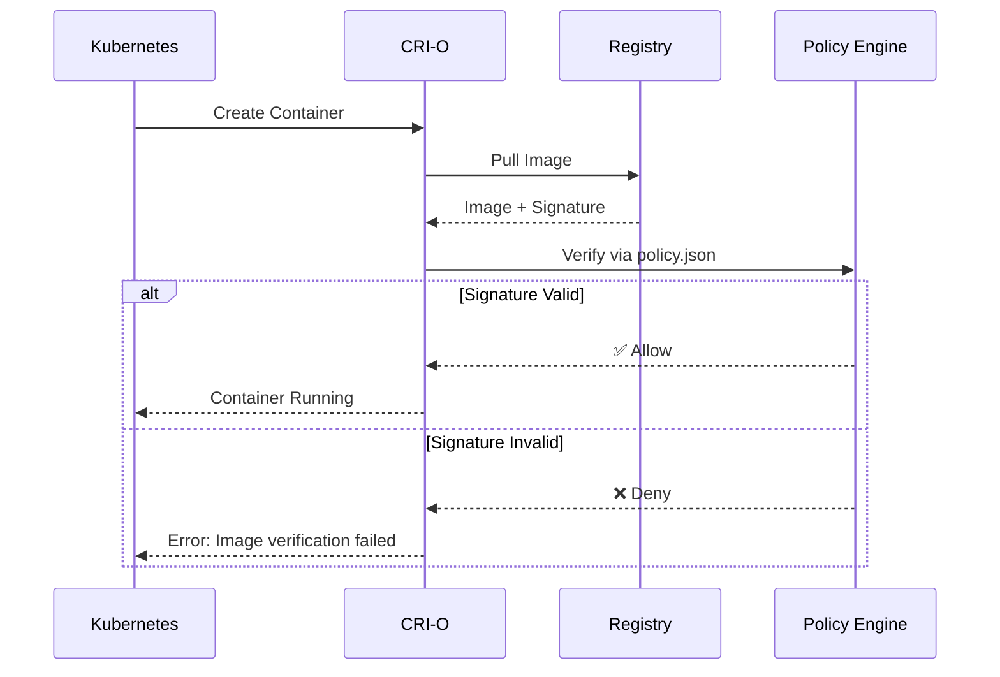
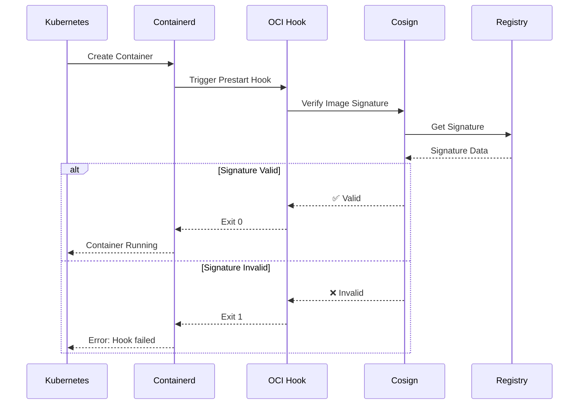

# Container Runtime Signature Verification - Quick Summary

## TL;DR

This POC adds **runtime-level signature verification** as a second layer of defense beyond admission controllers (Kyverno).

```
┌─────────────────────────────────────────────────────────────┐
│                    Defense in Depth                          │
├─────────────────────────────────────────────────────────────┤
│  Layer 1: Admission Controller (Kyverno) ✅ Already exists  │
│  Layer 2: Runtime Verification (CRI-O/Containerd) ⚡ NEW    │
└─────────────────────────────────────────────────────────────┘
```

## Two Approaches

### 1. CRI-O (Built-in Support) 🎯

**What**: CRI-O has native signature verification via policy.json  
**How**: Configure `/etc/containers/policy.json`  
**Where**: Requires VM (cannot modify local runtime)  
**Status**: Production-ready, simple configuration  

```bash
# Single policy file controls everything
/etc/containers/policy.json
```

### 2. Containerd (OCI Hooks) 🪝

**What**: Use OCI hooks to intercept container creation  
**How**: Custom hook script verifies signatures before start  
**Where**: Can work with Kind! (No VM required)  
**Status**: Custom solution, flexible  

```bash
# Hook runs before every container starts
OCI Hook → cosign verify → ✅ Allow / ❌ Deny
```

## Key Differences

| Aspect | CRI-O | Containerd |
|--------|-------|------------|
| Support | ✅ Native | 🔧 Via OCI Hooks |
| Setup | Simple | More Complex |
| Local Testing | ❌ Needs VM | ✅ Works with Kind |
| Production | ⭐⭐⭐⭐⭐ | ⭐⭐⭐⭐ |

## What Gets Built

### CRI-O Directory Structure
```
crio/
├── README.md                    # Full documentation
├── Makefile                     # Automation
├── config/
│   ├── policy.json             # Signature verification policy
│   └── registries.d/           # Registry configs
├── scripts/
│   ├── setup-vm.sh             # VM setup
│   ├── configure-crio.sh       # Configure CRI-O
│   └── test-verification.sh    # Run tests
└── manifests/
    ├── signed-pod.yaml         # Should work
    └── unsigned-pod.yaml       # Should fail
```

### Containerd Directory Structure
```
containerd/
├── README.md                    # Full documentation
├── Makefile                     # Automation
├── hooks/
│   ├── verify-signature.sh     # OCI hook script
│   └── config.json             # Hook config
├── config/
│   └── containerd-config.toml  # Containerd config
├── scripts/
│   ├── setup-kind.sh           # Kind cluster setup
│   ├── install-hooks.sh        # Install hooks
│   └── test-verification.sh    # Run tests
└── manifests/
    ├── signed-pod.yaml         # Should work
    └── unsigned-pod.yaml       # Should fail
```

## How It Works

### CRI-O Flow


### Containerd Flow


## Testing Strategy

### CRI-O (VM-based)
1. User creates VM with CRI-O
2. Run setup scripts from repo
3. Configure policy.json for signature verification
4. Deploy test pods (signed vs unsigned)
5. Verify: signed ✅ runs, unsigned ❌ fails

### Containerd (Kind-based)
1. Create Kind cluster with custom config
2. Install OCI hooks into Kind nodes
3. Configure containerd to use hooks
4. Deploy test pods (signed vs unsigned)
5. Verify: signed ✅ runs, unsigned ❌ fails

## Integration with Existing Repo

Reuses existing infrastructure:
- ✅ Cosign signing setup (already exists)
- ✅ Image signing process (already exists)
- ✅ Local registry (already exists)
- 🆕 Adds runtime-level verification
- 🆕 Adds second layer of defense

## Why Both?

1. **CRI-O**: Shows the "right way" - native support
2. **Containerd**: Shows flexibility and real-world solution for runtimes without native support
3. **Coverage**: Different users use different runtimes
4. **Learning**: Compare approaches and trade-offs

## Implementation Priority

### Option A: Start with Containerd (Recommended)
- ✅ Can test immediately with Kind
- ✅ No VM setup required
- ✅ Proves the concept quickly
- Later: Add CRI-O when VM is ready

### Option B: Start with CRI-O
- Requires VM setup first
- Shows native approach
- Simpler configuration
- Later: Add containerd

## Time Estimates

- **Planning & Documentation**: ✅ Done (this document)
- **Containerd POC**: ~4-5 hours
- **CRI-O POC**: ~3-4 hours (+ VM setup time)
- **Integration & Testing**: ~2-3 hours

**Total**: ~10-14 hours of development

## Success Criteria

### Minimum Viable POC
- [ ] Unsigned containers are blocked at runtime
- [ ] Signed containers start successfully
- [ ] Clear documentation on setup
- [ ] Reproducible test cases

### Complete POC
- [ ] Above + automated setup scripts
- [ ] Above + Makefile integration
- [ ] Above + comprehensive documentation
- [ ] Above + integration with existing signing flow

## Quick Start (Once Implemented)

### For Containerd (Kind)
```bash
cd containerd
make setup-kind        # Create Kind cluster with hooks
make sign-images       # Sign test images
make test             # Run verification tests
```

### For CRI-O (VM)
```bash
cd crio
./scripts/setup-vm.sh  # Setup VM with CRI-O
make configure         # Configure signature verification
make sign-images       # Sign test images
make test             # Run verification tests
```

## Questions?

See the detailed plan: [RUNTIME_VERIFICATION_PLAN.md](./RUNTIME_VERIFICATION_PLAN.md)
