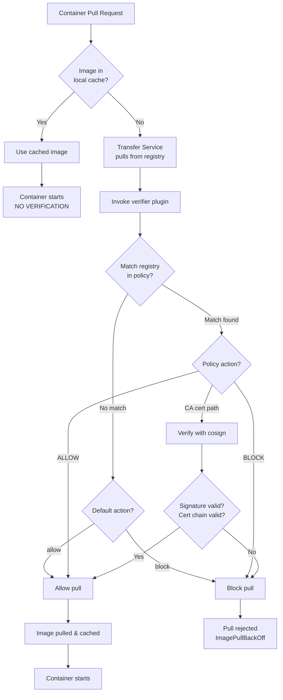

# Containerd Transfer Service Signature Verification

<!-- markdownlint-configure-file { "MD013": { "tables": false } } -->

Runtime signature verification using containerd 2.1+ Transfer Service with
BYO-PKI certificates (X.509).

## This is THE Official Approach

This implementation uses containerd's **official image verification plugin**
system (`io.containerd.image-verifier.v1.bindir`), which:

- Was merged in [PR #8493](https://github.com/containerd/containerd/pull/8493)
  (Sept 2023)
- Works with CRI since
  [PR #8515](https://github.com/containerd/containerd/pull/8515) (Apr 2025,
  containerd 2.1)
- Is the same approach used by
  [ratify-containerd](https://github.com/notaryproject/ratify-containerd)
  (Notary Project's PoC)
- Is documented in
  [containerd image-verification.md](https://github.com/containerd/containerd/blob/main/docs/image-verification.md)

**Roadmap Status (Nov 2025):**

- Transfer Service image verifier - available since containerd 2.0
- CRI uses Transfer Service by default - containerd 2.1+
- Cache bypass limitation - known, unlikely to change (by design)

## Known Limitation

**Transfer Service verifiers only run on registry pulls, NOT on cached images.**

This means:

- Cached images bypass verification
- Pre-loaded images run without checks
- `ctr image import` bypasses verification

**For production:** Use admission controllers (Kyverno, Ratify) as primary
control. Transfer Service is defense-in-depth only.

See [containerd issue #10768](https://github.com/containerd/containerd/issues/10768)
for discussion on this limitation.

## Requirements

- **containerd 2.1+** (Transfer Service + CRI integration)
- Ubuntu 24.04 VM with sudo

## Quick Start

```bash
make setup    # Install containerd 2.1+, k8s, docker, cosign (requires reboot)
# <reboot>
make run      # Installs verifier, initializes k8s, signs images, tests
```

## How It Works



**Note:** Cached images bypass verification entirely - this is a known limitation.

Containerd config (`/etc/containerd/config.toml`):

```toml
version = 3

[plugins.'io.containerd.transfer.v1.local']
  [[plugins.'io.containerd.transfer.v1.local'.unpack_config]]
    platform = 'linux/amd64'
    snapshotter = 'overlayfs'
    [plugins.'io.containerd.transfer.v1.local'.unpack_config.verifier]
      type = 'command'
      command = '/opt/containerd/image-verifier/bin/verifier'
      args = ['-name', '{src.name}', '-digest', '{src.digest}']
```

Verifier policy config (`/etc/containerd/image-verifier.conf`):

```bash
# Per-registry policies (regex patterns supported)
REGISTRY_POLICY_PRIMARY=127\.0\.0\.1:5000|/etc/containerd/certs/registry-primary-ca.crt
REGISTRY_POLICY_SECONDARY=127\.0\.0\.1:5001|ALLOW
REGISTRY_POLICY_GCR=gcr\.io|BLOCK

# Default action for unknown registries
VERIFY_DEFAULT_ACTION=allow
```

Policy enforces **4 scenarios** (same as CRI-O):

- `127.0.0.1:5000`: VERIFY with BYO-PKI
- `127.0.0.1:5001`: ALLOW without verification
- `gcr.io`: BLOCK
- Default: ALLOW

Verifier is a bash script that validates signatures using
[sigstore/cosign](https://github.com/sigstore/cosign).

## Testing

```bash
kubectl apply -f manifests/signed-pod.yaml              # → Running
kubectl apply -f manifests/unsigned-pod.yaml            # → ImagePullBackOff
kubectl apply -f manifests/gcr-blocked-pod.yaml         # → ImagePullBackOff
kubectl apply -f manifests/secondary-registry-pod.yaml  # → Running (no verification)
```

## Key Differences from CRI-O

| Feature | CRI-O | Containerd Transfer Service |
|---------|-------|----------------------------|
| Verification trigger | Every image use | Registry pull only |
| Cache bypass | No | Yes (cached images skip verification) |
| Config location | `/etc/containers/policy.json` | `/etc/containerd/image-verifier.conf` |
| Implementation | Native `containers/image` | External verifier plugin |
| Production use | Primary control | Defense-in-depth only |

## Alternatives for Notation/Notary

For **Notation (Notary v2)** signatures instead of Cosign, consider:

- [ratify-containerd](https://github.com/notaryproject/ratify-containerd) - Uses
  Ratify CLI as the verifier binary
- Works with the same `io.containerd.image-verifier.v1.bindir` plugin

## References

- [containerd Transfer
  Service](https://github.com/containerd/containerd/blob/main/docs/transfer.md)
- [containerd Image Verification
  Docs](https://github.com/containerd/containerd/blob/main/docs/image-verification.md)
- [PR #8493: Image verifier plugin](https://github.com/containerd/containerd/pull/8493)
- [PR #8515: CRI uses Transfer Service](https://github.com/containerd/containerd/pull/8515)
- [Issue #6691: Original feature request](https://github.com/containerd/containerd/issues/6691)
- [ratify-containerd PoC](https://github.com/notaryproject/ratify-containerd)
- [containerd 2.1 announcement](https://samuel.karp.dev/blog/2025/05/hello-containerd-2.1/)

<!-- cSpell:ignore kyverno,sigstore,ratify -->
