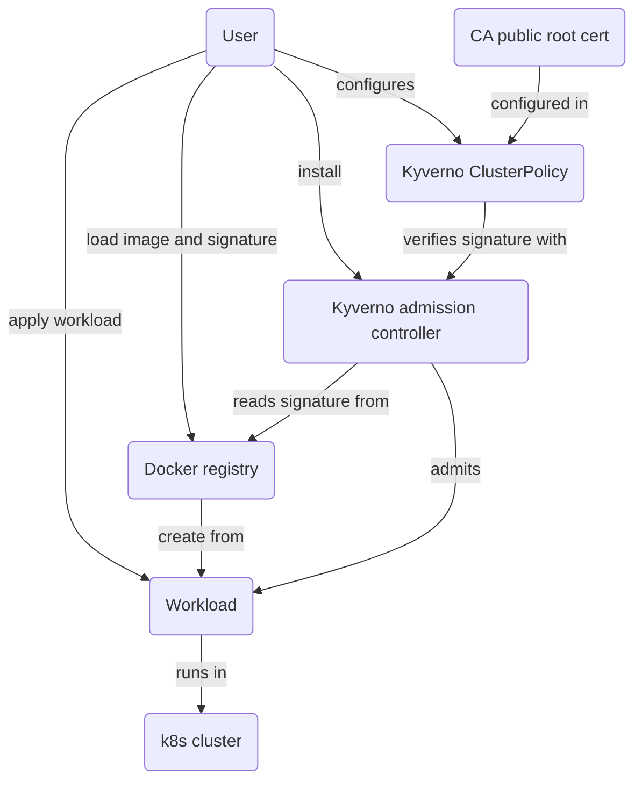

<!-- markdownlint-disable line-length -->
<!-- cSpell:ignore kyverno -->

# Image signature verification

Verifying image signatures runtime using Notation or Cosign, and Kyverno.

## Non-runtime verification

Verifying signatures with Notation "offline", please see
[Notation External Signer documentation](../notation/README.md).

Verifying signatures with Cosign "offline":
- [Cosign v2 documentation](../cosign-v2/README.md) (external signer)
- [Cosign v3 documentation](../cosign-v3/README.md) (native signing)

## Runtime verification

For runtime signature verification, we use
[Kyverno with Notation](https://kyverno.io/docs/writing-policies/verify-images/notary/),
or [Kyverno with Cosign](https://kyverno.io/docs/writing-policies/verify-images/sigstore/)

Both Cosign v2 and v3 use the same Kyverno policy with CA-based certificate
verification. The difference is only in the signing command and bundle format.

This is part of e2e tests, suggested to run via repository top-level `Makefile`
via `make notation`, `make cosign-v2`, or `make cosign-v3`.

Kyverno's Makefile has `make setup` sets up the full setup with Kind cluster,
local registry. Then run one of:
- `make -f cosign-v2.mk` (Cosign v2 tests with external signer)
- `make -f cosign-v3.mk` (Cosign v3 tests with native signing)
- `make -f notation.mk` (Notation tests)

Use `make clean` to remove everything.
